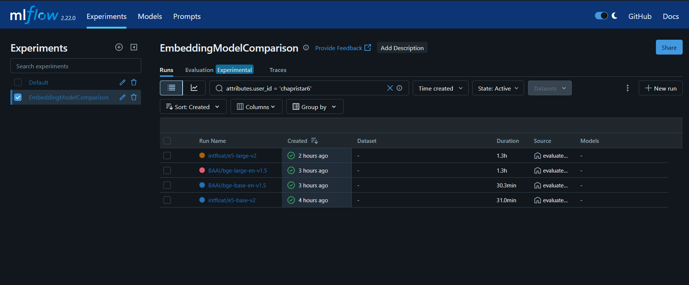
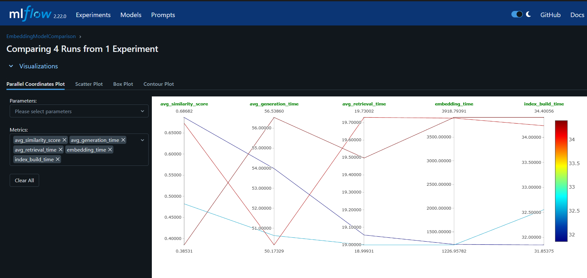
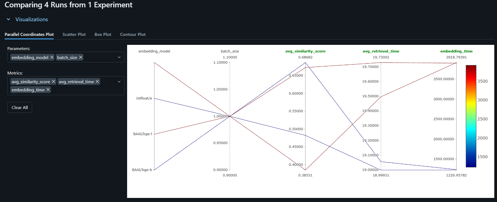

# Movie Savvy RAG

**Movie Savvy RAG** is an advanced Retrieval-Augmented Generation (RAG) system designed to answer queries about movies, anime, manga, K-dramas, and Bollywood content with precision and depth. It leverages a fine-tuned Mistral 7B model, a FAISS-based vector database, and real-time Reddit scraping to provide factual responses enriched with community insights. Built with cutting-edge NLP techniques and experiment tracking, this project is ideal for entertainment enthusiasts and developers alike.


---

## Key Features

- **Fine-Tuned Language Model**: Mistral 7B v0.1 fine-tuned on a synthetic dataset of ~300,000 instruction-input-output pairs derived from 27,000 scraped movie entries.
- **Vector Database**: FAISS indexing with the `intfloat/e5-large-v2` embedding model (selected via experimentation) for efficient retrieval of movie data.
- **Reddit Integration**: Custom scraper fetches relevant community discussions from Reddit when triggered by specific keywords (e.g., "reddit," "discussion").
- **Configurable Pipeline**: Flexible YAML-based configurations for fine-tuning, retrieval, and generation.
- **Experiment Tracking**: MLflow integration to evaluate embedding models and log performance metrics.

---

## Project Structure

The project is organized as follows:

- **`configs/`**: YAML files for model fine-tuning (`mistral-7b-custom-data.yaml`) and base settings (`mistral-7b.yaml`).
- **`data/`**: Raw scraped data and generated instruction pairs (not tracked in Git; managed by DVC).
- **`llm-finetune/`**: Contains the LitGPT library for fine-tuning the Mistral 7B model.
- **`mlruns/`**: MLflow logs for embedding model experiments.
- **`output/`**: Logs from the RAG pipeline (`logs/rag_pipeline.log`).
- **`rag_system/`**: Core RAG system components:
  - **`config/`**: RAG, model, and MLflow configurations (`rag_config.yaml`, `model_config.yaml`, `mlflow_config.yaml`).
  - **`data/`**: Processed data (`processed/`), raw data (`raw/`), and Reddit data (`processed/reddit_data/`).
  - **`generation/`**: Response generation scripts (`generator.py`) and prompt templates (`prompt_templates/`).
  - **`models/`**: Fine-tuned Mistral 7B checkpoints (`mistral-7b-finetuned/`).
  - **`retrieval/`**: Embedding (`embedder.py`) and retrieval (`retriever.py`) scripts, plus FAISS index (`index/`).
  - **`scripts/`**: Utility scripts for preprocessing (`预process_data.py`), index building (`build_index.py`), Reddit scraping (`reddit_scraper.py`), and running the pipeline (`run_rag.py`).
- **`requirements.txt`**: Python dependencies.

---

## Setup Instructions

### Prerequisites
- Python 3.10+
- Git
- DVC (for data version control)
- NVIDIA GPU with CUDA support (recommended for fine-tuning and inference)

### Steps

1. **Clone the Repository**:
   ```bash
   git clone https://github.com/yourusername/movie-savvy-rag.git
   cd movie-savvy-rag
   ```

2. **Install Dependencies**:
   ```bash
   pip install -r requirements.txt
   ```

3. **Set Up Environment Variables**:
   - Create a `.env` file in the root directory:
     ```
     REDDIT_CLIENT_ID=your_reddit_client_id
     REDDIT_CLIENT_SECRET=your_reddit_client_secret
     REDDIT_USER_AGENT=your_reddit_user_agent
     SERPER_API_KEY=your_serper_api_key
     ```

4. **Pull Data with DVC**:
   - Fetch raw and processed data:
     ```bash
     dvc pull
     ```

5. **Download Fine-Tuned Model**:
   - Place the fine-tuned Mistral 7B model in `rag_system/models/mistral-7b-finetuned/`. (Managed via DVC; use `dvc pull` if tracked.)

6. **Preprocess Data**:
   - Process raw data into chunks and embeddings:
     ```bash
     python rag_system/scripts/preprocess_data.py
     python rag_system/retrieval/embedder.py
     ```

7. **Build FAISS Index**:
   - Create the vector store index:
     ```bash
     python rag_system/scripts/build_index.py
     ```

---

## Usage

### Command-Line Interface (CLI)
Run the RAG system interactively:
```bash
python rag_system/scripts/run_rag.py
```
- Enter your query (e.g., "Give me top 5 Bollywood comedy movies").
- Type `quit` to exit.


### API
Launch the FastAPI server:
```bash
python rag_system/scripts/run_rag.py --server
```
- Access at `http://localhost:8001`.
- Query via POST to `/query`:
  ```json
  {
    "query": "What is the plot of Inception?"
  }
  ```
- Optional parameters: `top_k`, `max_new_tokens`, `temperature`, `top_k_sampling`.


---

## Fine-Tuning

The Mistral 7B v0.1 model was fine-tuned using LitGPT on a synthetic dataset of ~300,000 instruction-input-output pairs generated with Gemini 1.5 Flash from 27,000 scraped movie entries (sourced from IMDb, MDL, etc.). Key settings:
- **LoRA**: `r=32`, `alpha=16`, `dropout=0.05`, applied to query and value projections.
- **Training**: Batch size=16, learning rate=0.0001, 1 epoch, `bf16` precision.
- **Data**: Alpaca-style JSON dataset in `data/custom/`.
- Config: `configs/mistral-7b-custom-data.yaml`.

See [LitGPT documentation](https://github.com/Lightning-AI/litgpt) for details.

---

## RAG Pipeline

1. **Query Processing**: Extracts key terms and checks for Reddit triggers.
2. **Retrieval**:
   - **Vector Store**: FAISS retrieves top-k chunks using `intfloat/e5-large-v2` embeddings.
   - **Reddit**: Fetches discussions if triggered (via `SmartRedditScraperBotWithEmbeddings`).
3. **Generation**: Fine-tuned Mistral 7B generates responses using retrieved contexts.

Configurable via `rag_system/config/rag_config.yaml`.

---

## Evaluation

### Embedding Model Selection
We evaluated multiple embedding models using MLflow to determine the best performer for our RAG pipeline. The experiment compared models based on semantic similarity, retrieval time, embedding latency, generation time, and index build time.

**Key Findings:**
- `intfloat/e5-large-v2` outperformed other models, achieving the highest similarity score (0.6868) with balanced retrieval and generation times.

**Sample Metrics:**

| Model               | Similarity | Retrieval Time | Embedding Time | Generation Time |
|---------------------|------------|----------------|----------------|-----------------|
| `e5-large-v2`       | 0.6868     | 19.1 ms        | 1226 ms        | 50.2 s          |
| `bge-large-v1.5`    | 0.3853     | 19.7 ms        | 3918 ms        | 56.5 s          |





Run the evaluation:
```bash
python rag_system/scripts/evaluate_embedding_models.py
```

View results:
```bash
mlflow ui --backend-store-uri rag_system/output/mlruns
```
Navigate to `http://localhost:5000`.

---

## Examples

### Factual Query
**Query**: "What is the plot of Inception?"  
**Response**:  
> "Inception" (2010), directed by Christopher Nolan, follows Dom Cobb, a skilled thief who infiltrates dreams to steal secrets. Hired for an "inception" job—planting an idea into a target's subconscious—Cobb assembles a team to navigate layered dream worlds, blurring reality and illusion in a mind-bending heist.

### Recommendation with Reddit
**Query**: "Give me top 5 suspense thriller animes most discussed on Reddit"  
**Response**:  
> Here’s a geeky rundown of the top 5 suspense thriller animes buzzing on Reddit:  
> 1. **Death Note** - Light Yagami’s deadly notebook game of wits is a fan fave for its tension.  
> 2. **Future Diary (Mirai Nikki)** - A survival game with future-predicting diaries; Reddit loves the chaos!  
> 3. **Erased** - Time-travel murder mystery that’s got fans hooked on its emotional stakes.  
> 4. **Code Geass** - Mind games and rebellion; Redditors debate Lelouch’s every move.  
> 5. **Psycho-Pass** - Dystopian crime thriller; fans say it’s a brain-twister worth binging.

---

## Technologies Used

- **Language Model**: Mistral 7B v0.1 (fine-tuned with LitGPT)
- **Embedding Model**: `intfloat/e5-large-v2`
- **Vector Database**: FAISS
- **Web Scraping**: Cloudscraper, PRAW (Reddit API)
- **Experiment Tracking**: MLflow
- **API**: FastAPI
- **Data Processing**: Pandas, NumPy, SentenceTransformers
- **Deep Learning**: PyTorch

---

## Contributing

1. Fork the repository.
2. Create a feature/bugfix branch (`git checkout -b feature/your-feature`).
3. Commit changes (`git commit -m "Add your message"`).
4. Push to the branch (`git push origin feature/your-feature`).
5. Open a pull request with a detailed description.

---

## License

This project is licensed under the MIT License. See the [LICENSE](LICENSE) file for details.

